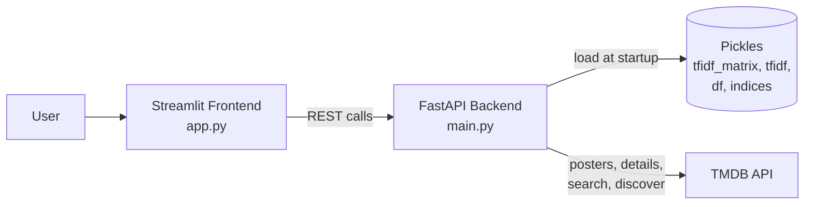

# 🎬 Movie Recommender System

A full-stack, content-based movie recommendation app. Search any movie, open its details page, and get two kinds of recommendations: **similar movies** from a custom-built TF-IDF model, and **more movies in the same genre** from TMDB.

**Stack:** Python · scikit-learn · FastAPI · Streamlit · TMDB API

## ✨ Features

- **Home feed** with five live TMDB categories: Trending, Popular, Top Rated, Now Playing, Upcoming
- **Keyword search** with autocomplete-style suggestions and a poster grid of matches
- **Movie details page** with poster, backdrop, release date, genres and overview
- **TF-IDF recommendations** ("Similar Movies"): content-based, computed from a local dataset of ~45,000 movies using cosine similarity
- **Genre recommendations** ("More Like This"): popular movies in the same genre, pulled from TMDB
- **Graceful fallbacks:** if the TF-IDF model can't find a movie, the app still shows genre recommendations instead of failing

---

## 🏗️ Architecture



1. The **model** was built offline in a notebook and saved as pickle files.
2. The **FastAPI backend** loads those files once at startup, exposes the recommendation logic as REST endpoints, and proxies TMDB so the API key never reaches the browser.
3. The **Streamlit frontend** handles the UI, routing between the home and details views, and calls the backend.

---

## 🧠 How the recommendation model works

**Dataset:** [The Movies Dataset](https://www.kaggle.com/datasets/rounakbanik/the-movies-dataset) (`movies_metadata.csv`), 45,466 rows, 24 columns. After removing duplicates and rows without a title, **45,447 movies** remain.

**Pipeline** (see [`movies.ipynb`](movies.ipynb)):

1. **Select and clean** the columns `title`, `overview`, `genres`, `tagline`. Missing text is filled with empty strings, and the genres column (stored as a stringified list of dicts) is parsed with `ast.literal_eval` into plain genre names.
2. **Build a `tags` column** by concatenating overview + genres + tagline.
3. **Preprocess the text:** lowercase → remove punctuation and digits → remove stopwords (NLTK) → lemmatize (WordNet).
4. **Vectorize** with `TfidfVectorizer(max_features=50000, ngram_range=(1, 2), stop_words='english')`, giving a sparse matrix of shape `(45447, 50000)`.
5. **Recommend** by computing cosine similarity between the chosen movie's vector and every other movie, then returning the top N.
6. **Serialize** the vectorizer, matrix, DataFrame and title→index map to `.pkl` files so the API can load them without retraining.

Because TF-IDF vectors are L2-normalised, the dot product used in the API is equal to cosine similarity.

### Quick evaluation

There are no ground-truth labels for a recommender, so genre overlap was used as a proxy for relevance. On 500 randomly sampled movies:

| Metric | Result |
|---|---|
| Precision@10 (recommendation shares ≥1 genre) | ~0.70 |
| Mean genre Jaccard overlap | ~0.42 |

> ⚠️ These numbers are optimistic: genres are part of the `tags` text, so the model sees them. Text-only evaluation (overview + tagline without genres) is a planned improvement.

---

## 📁 Project structure

```
movie-recommender/
├── main.py              # FastAPI backend (routes, TMDB client, TF-IDF logic)
├── app.py               # Streamlit frontend
├── movies.ipynb         # Data cleaning, preprocessing, TF-IDF model building
├── df.pkl               # Cleaned movie DataFrame
├── indices.pkl          # Title -> row index map
├── tfidf.pkl            # Fitted TfidfVectorizer
├── tfidf_matrix.pkl     # Sparse TF-IDF matrix (45,447 x 50,000)
├── requirements.txt
├── .env.example         # Template for your TMDB key
└── README.md
```

`movies_metadata.csv` is not included because of its size. Download it from the Kaggle link above if you want to re-run the notebook.

---

## 🚀 Getting started

### Prerequisites

- Python 3.10+
- A free [TMDB API key](https://www.themodb.org/settings/api)

### 1. Clone and install

```bash
git clone https://github.com/<your-username>/movie-recommender.git
cd movie-recommender

python -m venv venv
source venv/bin/activate        # Windows: venv\Scripts\activate

pip install -r requirements.txt
```

### 2. Add your TMDB key

Create a `.env` file in the project root:

```env
TMDB_API_KEY=your_tmdb_api_key_here
```

### 3. Start the backend

```bash
uvicorn main:app --reload
```

The API runs at `http://127.0.0.1:8000`, with interactive docs at `http://127.0.0.1:8000/docs`.

### 4. Point the frontend at your local API

In `app.py`, set:

```python
API_BASE = "http://127.0.0.1:8000"
```

### 5. Start the frontend

```bash
streamlit run app.py
```

Open `http://localhost:8501`.

---

## 🔌 API reference

| Method | Endpoint | Description |
|---|---|---|
| GET | `/health` | Health check |
| GET | `/home?category=&limit=` | Home feed. `category`: `trending`, `popular`, `top_rated`, `now_playing`, `upcoming` |
| GET | `/tmdb/search?query=&page=` | Keyword search, returns raw TMDB results |
| GET | `/movie/id/{tmdb_id}` | Movie details (title, overview, genres, poster, backdrop) |
| GET | `/recommend/tfidf?title=&top_n=` | TF-IDF recommendations with similarity scores |
| GET | `/recommend/genre?tmdb_id=&limit=` | Popular movies sharing the movie's first genre |
| GET | `/movie/search?query=&tfidf_top_n=&genre_limit=` | Bundle: details + TF-IDF recs (with posters) + genre recs |

**Example**

```bash
curl "http://127.0.0.1:8000/recommend/tfidf?title=Avatar&top_n=5"
```

```json
[
  { "title": "Avatar 2", "score": 0.41 },
  { "title": "...", "score": 0.30 }
]
```

_(Scores shown are illustrative.)_

---

## ☁️ Deployment

- **Backend:** deployed on [Render](https://render.com) as a web service. Start command: `uvicorn main:app --host 0.0.0.0 --port $PORT`. Add `TMDB_API_KEY` under Environment Variables.
- **Frontend:** can be deployed on [Streamlit Community Cloud](https://streamlit.io/cloud). Set `API_BASE` to your Render URL.

---

## ⚠️ Known limitations

- **Cold-start latency:** TF-IDF results need a TMDB poster lookup for each recommendation (one extra request per movie), so the details page can be slow.
- **Local-dataset coverage:** the TF-IDF model only knows the ~45k movies in the Kaggle dataset, which ends around 2017. Newer movies (e.g. those on the home feed) will fall back to genre recommendations.
- **Genre recommendations use only the first genre** of the selected movie.
- **Title matching:** the backend matches movies to the local dataset by title, so remakes sharing a title map to one entry.
- **Pickle compatibility:** the `.pkl` files should be loaded with the same scikit-learn version that created them.

---

## 🔮 Future improvements

- Evaluate on text-only vectors (no genre leakage) and tune `min_df`, `sublinear_tf` and n-gram range
- Blend similarity with `vote_average` and `popularity` when ranking
- Match on TMDB ID instead of title, and cache poster lookups
- Try sentence embeddings (e.g. Sentence-BERT) and compare against TF-IDF
- Recommend using multiple genres, cast and director

---

## 🙏 Acknowledgements

- [The Movies Dataset](https://www.kaggle.com/datasets/rounakbanik/the-movies-dataset) on Kaggle
- [TMDB](https://www.themoviedb.org/) for posters and metadata

This product uses the TMDB API but is not endorsed or certified by TMDB._


## 👤 Author

**Sakshith**
B.Tech in Computer Science & Engineering (Data Science)

[GitHub](https://github.com/<your-username>) · [LinkedIn](https://linkedin.com/in/<your-handle>)
